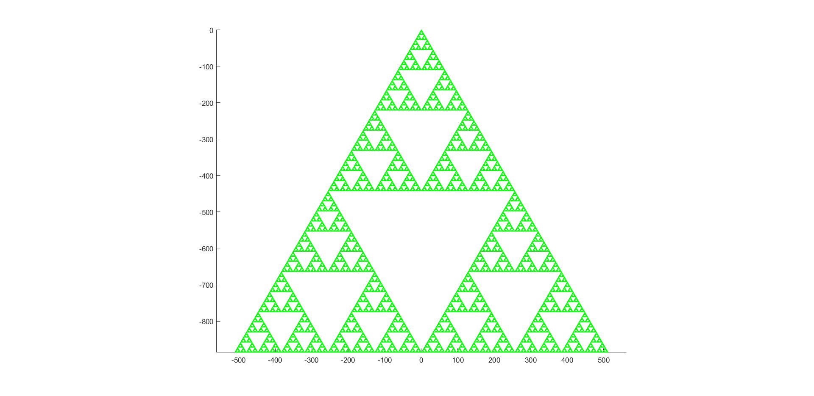
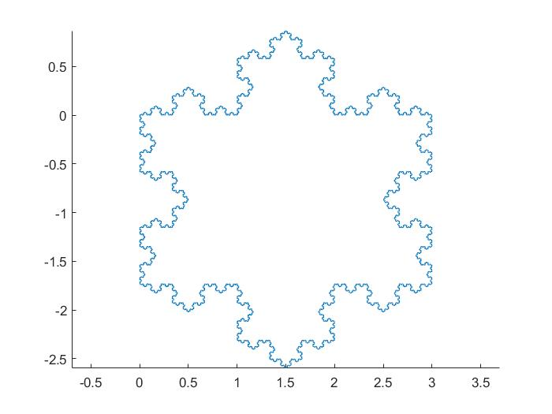

## Recursive geometry

This repository contains some algorithms that reproduce fractal paterns using complex numbers and recursion.

# Specifications

You will need Matlab installed on your computer, it also runs on Octave.

# Content

 

